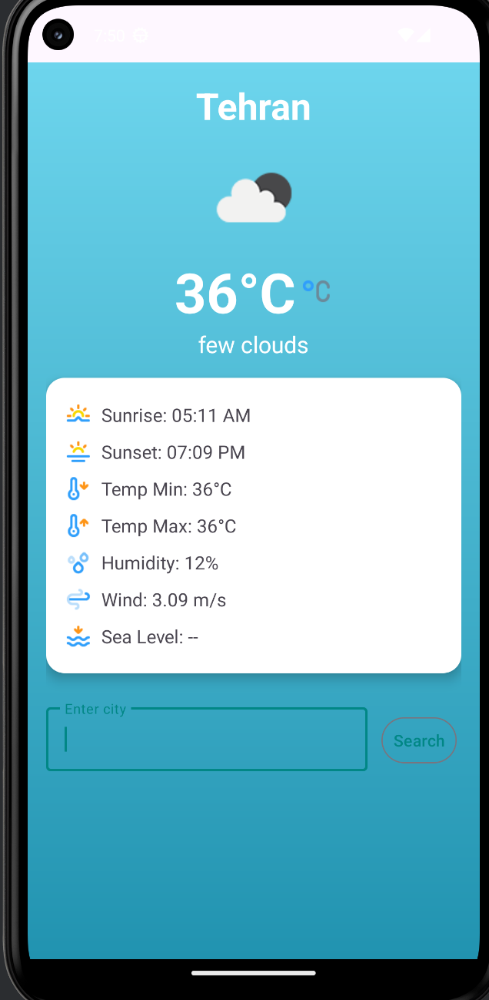
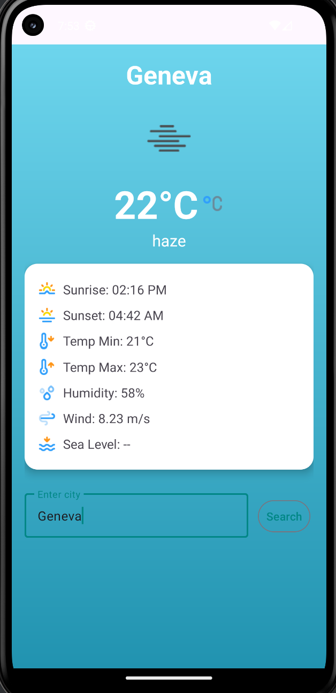
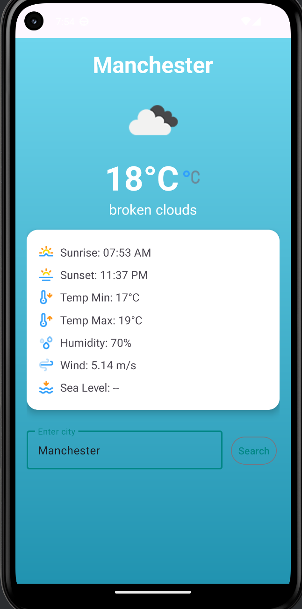

# 🌤 WeatherApp – Modern Android Weather Application

WeatherApp is a modern and simple Android application that displays weather information using the **OpenWeather API**.  
It is built with **Material Design 3** and features attractive icons and graphics for a better user experience.

---

## ✨ Features
- Search for any city and display current weather data
- Shows:
  - 🌅 Sunrise and sunset time
  - 🌡 Minimum and maximum temperatures
  - 💧 Humidity
  - 🌬 Wind speed
  - 🌊 Sea level / pressure
- Beautiful gradient background
- Built with **Material 3** and **CardView**
- Weather condition icons
- Fully responsive design (works on both phones and tablets)

---

## 🖼 Preview
| Main Screen | Search City || Search City |
|-------------|-------------||-------------|
|  |  ||  |

*(Make sure to add actual screenshots to the `screenshots` folder in the repository)*

---

## 🛠 Requirements
- Android Studio Ladybug or newer
- Minimum **minSdkVersion 21**
- A free API key from [OpenWeather](https://openweathermap.org/api)
- Internet connection

---

## 📦 Installation & Run
1. Clone the repository:
   git clone https://github.com/USERNAME/WeatherApp.git

2. Open the project in Android Studio.

3. Add your API key:  
   Open `MainActivity.kt` and find the line:
   val request = Request.Builder()
       .url("https://api.openweathermap.org/data/2.5/weather?q=$cityName&appid=YOUR_API_KEY")
   Replace `YOUR_API_KEY` with your own API key.

4. Run the app on an emulator or physical device.

---

## 📂 Project Structure
WeatherApp/
│
├── app/src/main/java/com/alijt/weatherapp/
│   ├── MainActivity.kt        # Main app logic
│
├── app/src/main/res/layout/
│   ├── activity_main.xml      # Main UI layout
│
├── app/src/main/res/drawable/
│   ├── bg_gradient.xml        # Gradient background
│   ├── sunrise.png            # Sunrise icon
│   ├── sunset.png             # Sunset icon
│   ├── tempdown.png           # Min temperature icon
│   ├── tempup.png             # Max temperature icon
│   ├── humidity.png           # Humidity icon
│   ├── wind.png               # Wind icon
│   ├── lowtide.png            # Sea level / pressure icon
│
├── README.md                  # This file

---

## 📜 License
This project is licensed under the **MIT License** – feel free to use it for personal or educational purposes.

---

## 👨‍💻 Developer
- **Your Name**
- [GitHub](https://github.com/AliJohari05)
- [Email](alitehranijohari1384@gmail.com)
